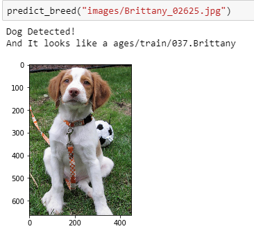
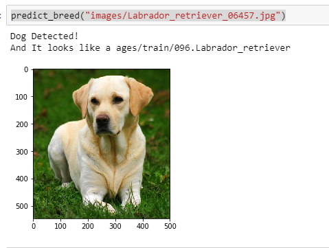

# Dog-Breed-Classifier
This project was created in order to help identify dog breeds from any image that contains dog. The data set is one from sklearn and contains 8351 dog images in 133 categories. The project is based on Convolutional Neural network (CNN or ConvNet). First i build CNN from scratch. The accuracy of the model was less than 10% which is very low and not acceptable. The goal is to classify images of dogs according to their breed.

### The Road Ahead

We break the notebook into separate steps.  Feel free to use the links below to navigate the notebook.

* [Step 0](#step0): Import Datasets
* [Step 1](#step1): Detect Humans
* [Step 2](#step2): Detect Dogs
* [Step 3](#step3): Create a CNN to Classify Dog Breeds (from Scratch)
* [Step 4](#step4): Use a CNN to Classify Dog Breeds (using Transfer Learning)
* [Step 5](#step5): Create a CNN to Classify Dog Breeds (using Transfer Learning)
* [Step 6](#step6): Write your Algorithm
* [Step 7](#step7): Test Your Algorithm

---

## Step 0: Import Datasets

### Import Dog Dataset

we import a dataset of dog images provided in workspace.  We populate a few variables through the use of the `load_files` function from the scikit-learn library:
- `train_files`, `valid_files`, `test_files` - numpy arrays containing file paths to images
- `train_targets`, `valid_targets`, `test_targets` - numpy arrays containing onehot-encoded classification labels 
- `dog_names` - list of string-valued dog breed names for translating labels

### Detect Humans
Human face is detected using opencv haarcascade feature. frontalface.xml file was user to detect human face from the image

### Detect Dogs
Pre-trained ResNet-50 model is used to detect dogs in images

### Create a CNN to Classify Dog Breeds (from Scratch)
We use Tensorflow keras to build CNN architecture.
Following CNN Architecture was build 
conv2d_1 (Conv2D)            (None, 224, 224, 16)      208       
_________________________________________________________________
max_pooling2d_2 (MaxPooling2 (None, 112, 112, 16)      0         
_________________________________________________________________
conv2d_2 (Conv2D)            (None, 112, 112, 32)      2080      
_________________________________________________________________
max_pooling2d_3 (MaxPooling2 (None, 56, 56, 32)        0         
_________________________________________________________________
conv2d_3 (Conv2D)            (None, 56, 56, 64)        8256      
_________________________________________________________________
max_pooling2d_4 (MaxPooling2 (None, 28, 28, 64)        0         
_________________________________________________________________
dropout_1 (Dropout)          (None, 28, 28, 64)        0         
_________________________________________________________________
flatten_2 (Flatten)          (None, 50176)             0         
_________________________________________________________________
dense_1 (Dense)              (None, 512)               25690624  
_________________________________________________________________
dropout_2 (Dropout)          (None, 512)               0         
_________________________________________________________________
dense_2 (Dense)              (None, 133)               68229     

=================================================================

Total params: 25,769,397
Trainable params: 25,769,397
Non-trainable params: 0
_________________________________________________

### Use a CNN to Classify Dog Breeds (using Transfer Learning)
To reduce training time without sacrificing accuracy, Bottleneck features from a different pre-trained model VGG16, Xception ResNet50  is used in this project. 

### Testing

# Blog Post
The whole proect along with its result is published in the medium blog post. [Click here](https://medium.com/@rojandhimal1/cnn-and-transfer-learning-for-dog-breed-classification-34de15596cdc) 

